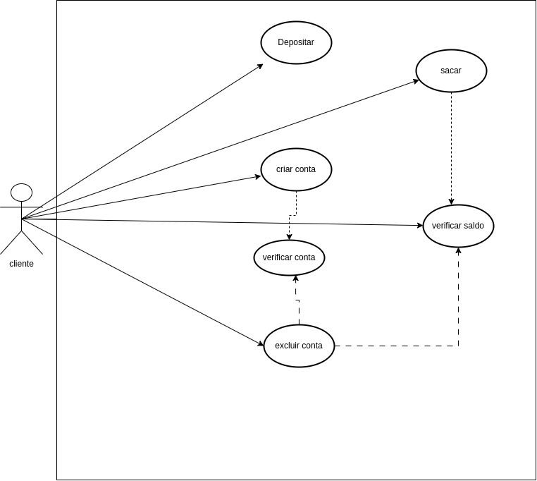
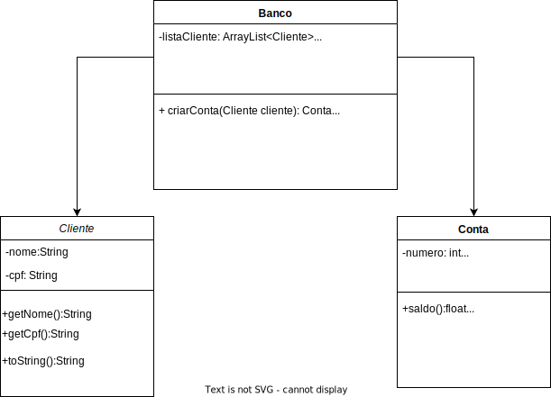

<h1>Bertoti</h1>
<h3>11/08/2023</h3>
We see three critical differences between programming and software engineering: time, scale, and the trade-offs at play. On a software engineering project, engineers need to be more concerned with the passage of time and the eventual need for change. In a software engineering organization, we need to be more concerned about scale and efficiency, both for the software we produce as well as for the organization that is producing it. Finally, as software engineers, we are asked to make more complex decisions with higher-stakes outcomes, often based on imprecise estimates of time and growth.

in summary, software engineering needs to prioritize time, scalability and trade-offs.
trayd-of: wins at something and loses at another, there is don't perfect technology that solves all problems in the best possible way.

<h3>14/08/2023</h3>

Within Google, we sometimes say, “Software engineering is programming integrated over time.” Programming is certainly a significant part of software engineering: after all, programming is how you generate new software in the first place. If you accept this distinction, it also becomes clear that we might need to delineate between programming tasks (development) and software engineering tasks (development, modification, maintenance). The addition of time adds an important new dimension to programming. Cubes aren’t squares, distance isn’t velocity. Software engineering isn’t programming.

three example of trade-offs:

1-)Language choice: many times when choosing a language, the software engineer needs to analyze which language can generate a better optimization to develop the program.
because there are languages ​​that occupy more space in the memory, greater expenditure of energy and time.

example: for embedded software, the "C" language is used, as it is a language closer to the machine, and has better time and energy expenditure.

2-)Usability: making a program simpler for the user can often make the program less protected and more vulnerable.

3-)Performance: If the development team to choose a clean code with better performance, it increases complexity to develop.

<h3>18/08/2023</h3>

1-)Visibility of system status:
bad pratic: Windows starting screen. The user doesn't know exactly what is starting, this information is unnecessary for the user.

  

god pratic: WhatsApp displays to the user if the other person is typing or sending an audio message.

2-)Match between system and the real world

  

Bad pratice: Error 404, user don't know error 404.
Good pratice: Screen reporting that the page is not available.

3-) User control and freedom

  

Bad pratice:Windows becomes unresponsive, only responds to a Ctrl + Alt + Delete command to open the Task Manager, allowing the user to terminate the program causing the freeze.
Good pratice: Button for cancel page

4-) Consistency and standards:

  

bad pratice: Detran website, the search bar is located in the middle of the page.. very hide!
Good pratice: YouTube places the search button right at the beginning of the screen and very prominently.

5-) Error prevention:

  

Bad pratice: Not handling an input field.
Good pratice: Adding a dropdown with the data, so the user doesn't have to input.

6-) Recognition rather than recall:
Bad pratice: Date field without referencing the current day.
Good pratice: Date field to remind the day to the user.

7-) Flexibility and efficiency of use

  

Good pratice: Keyboard shortcuts

8-) Aesthetic and minimalist design

  

Good pratice: A minimalist website without frills.
Bad pratice: Screen with visual clutter.

9-) Help users recognize, diagnose, and recover from errors

  

Good pratice: Blue screen of Windows with instructions.
Bad pratice: Error 404

10-) Help and documentation

  

Good pratice: one good documentation.

<h3>25/08/2023</h3>

<h3>28/08/2023</h3>

<h3>Uml</h3>

