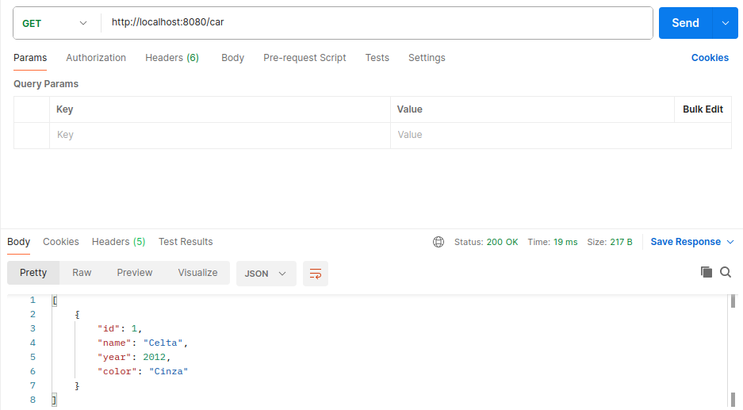
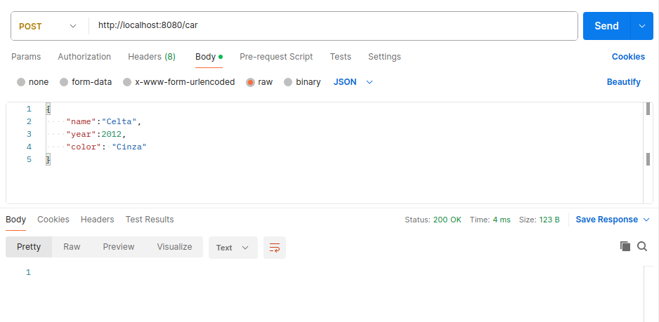
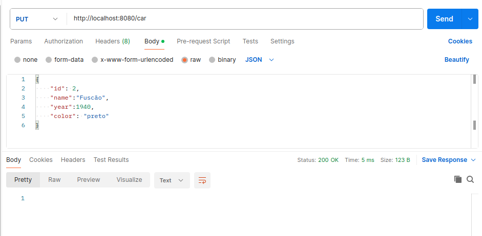
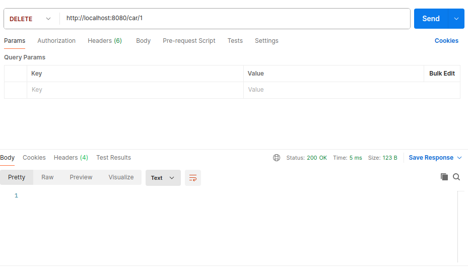

<h1>Crud of Car</h1>

<h3>1.Method Get</h3>

This method is used to search data in the server

<h3>2.Method Post</h3>

This method is used to refister data in the server

<h3>3.Method Put</h3>

This method is used to update data in the server

  

<h3>4.Method delete</h3>

This method is used to delete data in the server

  

